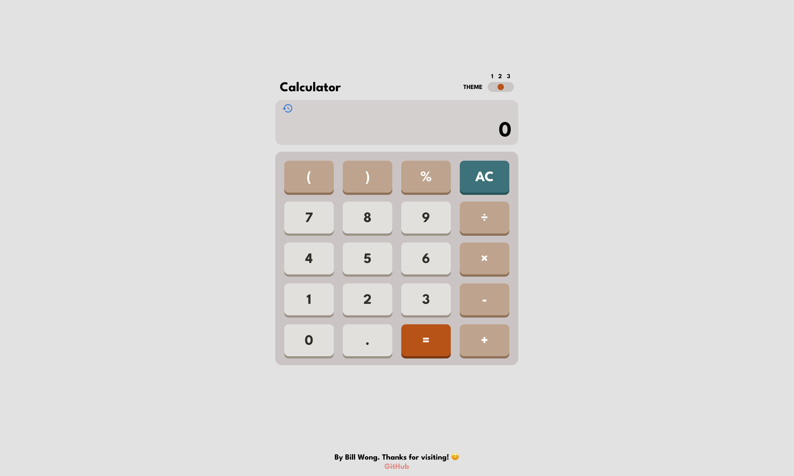
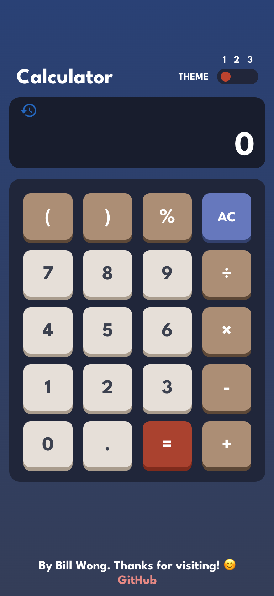
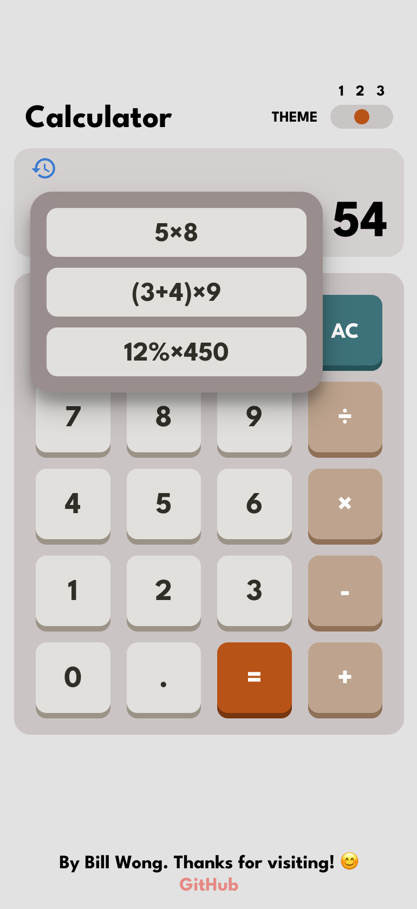
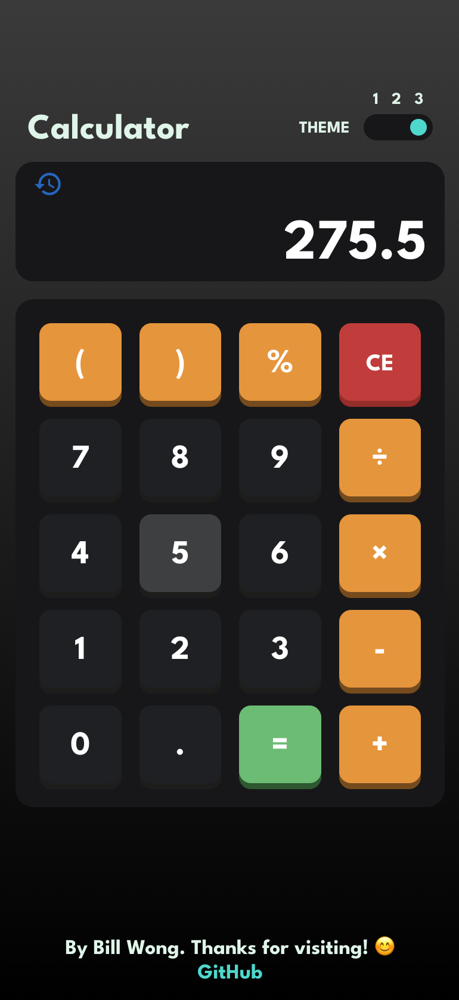

# **Calculator App** - [_Link here_](https://ui-calculate.web.app)

### I decided to create this project after learning about TypeScript and frontend testing with Jest and React Testing Library. 

> ### I was able to solidify my understanding with:
>
> - TypeScript to statically type functions and interfaces to improve code organisation and debugging.
> - React hooks such as useState, useEffect, and useRef.
> - Unit tests with Jest and React Testing Library for coverage to ensure webpage behaviour is correct.
> - Integrating a CI/CD pipeline with GitHub Actions for an automated workflow of building to testing to deployment.
> - CSS global variables and document attributes to define themes.
> - Animations with CSS and JavaScript
> - Responsive frontend design for different devices.

### Update - August 2022

After completing the course "The Art of Software Design" at uni, I was able to apply the knowledge that I learnt to refactor the existing code to eliminate underlying issues such as long conditional logic and passing many props to subcomponents. I used a factory design pattern for the calculator buttons and made separate components using interfaces for different buttons to avoid long conditional statements in the main file. By doing so, the new design has less coupling and higher cohesion between components, and adheres to SOLID principles better. This makes it easier to add new functionality, such as the calculator history feature.

### Desktop Preview:

### Mobile Preview:

 
    
    
    

