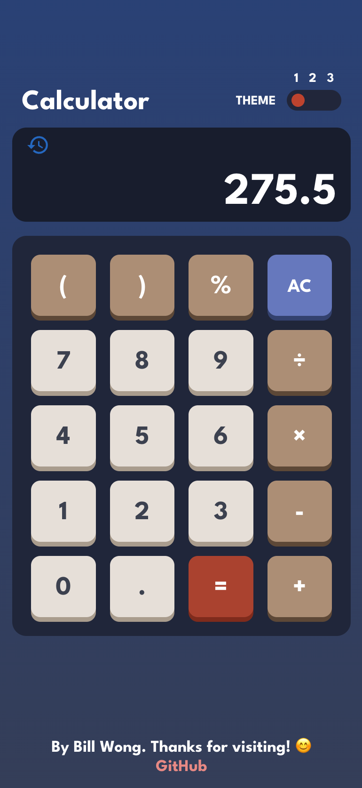

# **Calculator App** - [_Link here_](https://ui-calculate.web.app)

### I decided to create this project after learning about TypeScript and frontend testing with Jest and React Testing Library. 

> ### I was able to solidify my understanding with:
>
> - TypeScript to statically type functions and data to improve code organisation and debugging.
> - Figma to design the website UI and implemented front-end features such as mobile responsiveness and theme selection.
> - Achieved 100% coverage by writing unit tests with Jest and React Testing Library.
> - Integrated a CI/CD pipeline with GitHub Actions for an automated workflow.
> - CSS global variables and document attributes to define themes.

### Desktop Preview:

### Mobile Preview:

 
    
    
    

